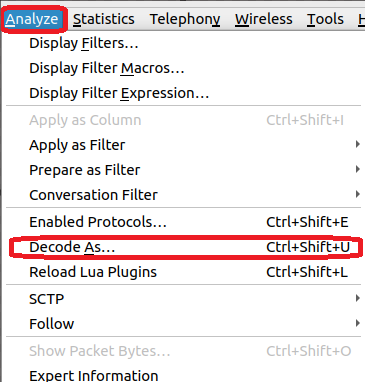
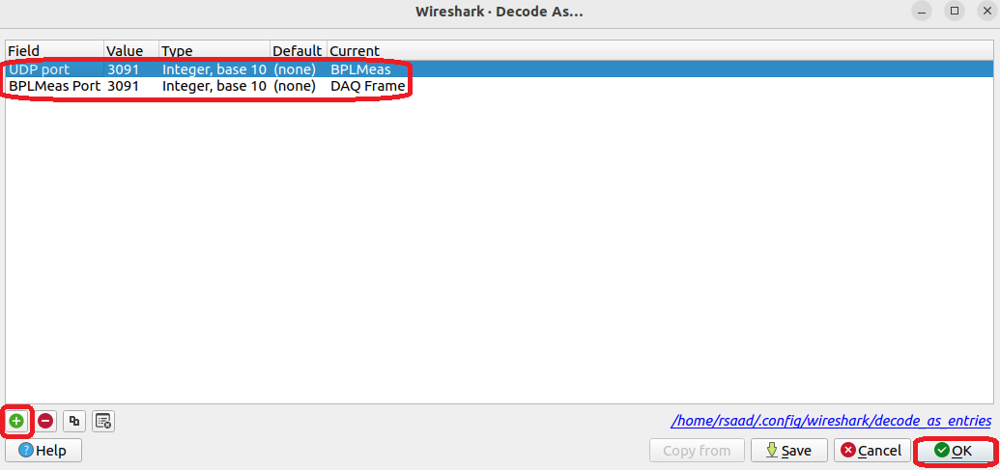
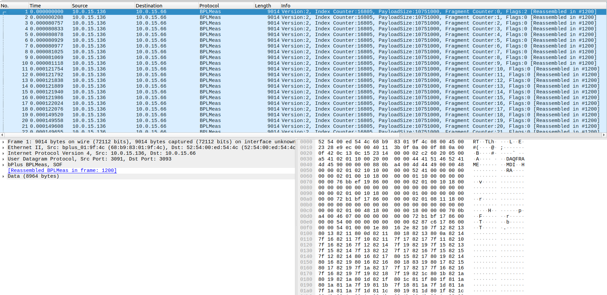
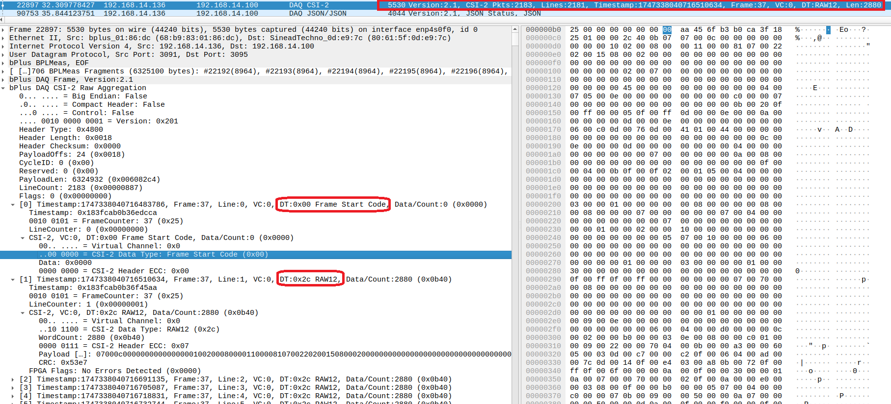
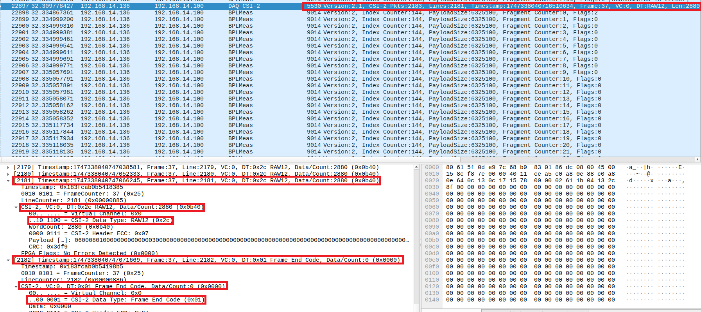
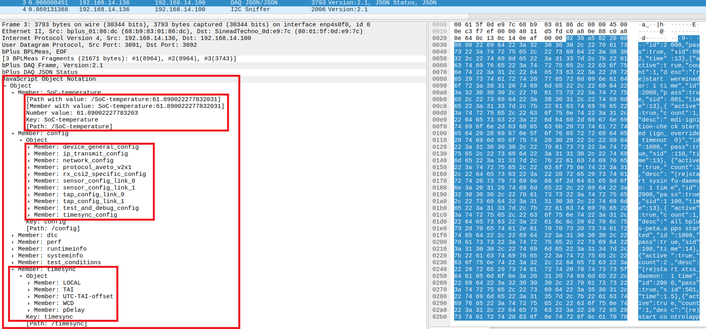
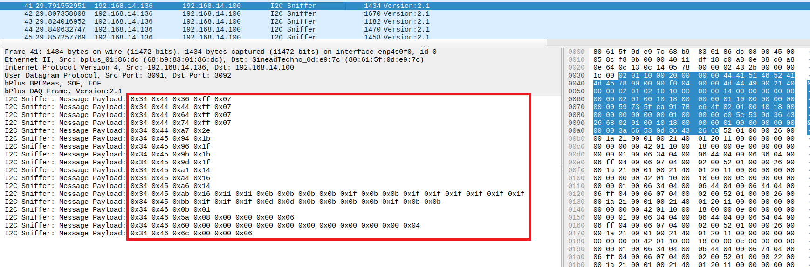
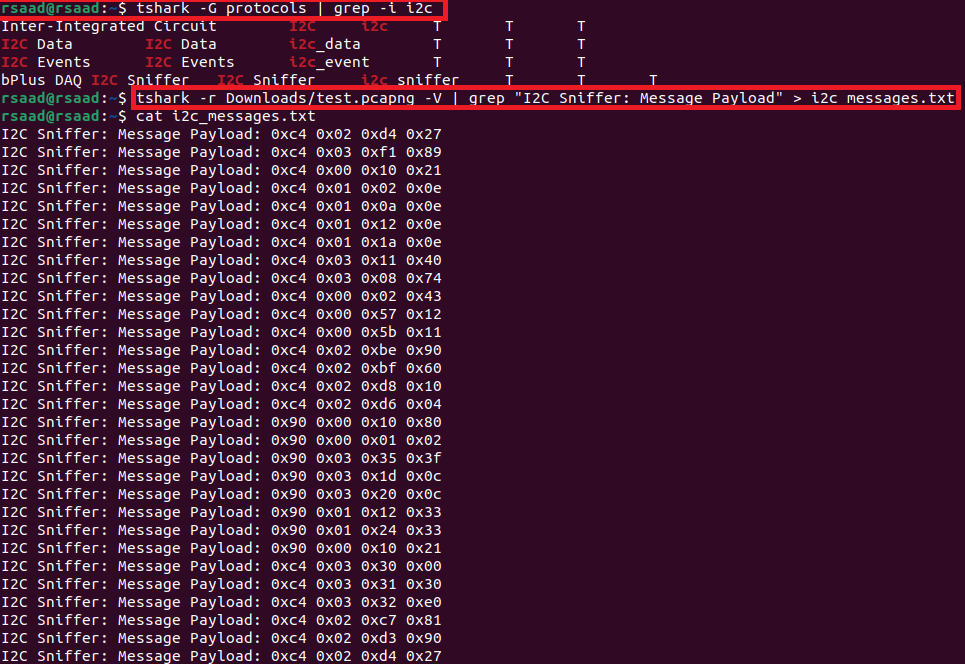

# Using the b-plus MDILink Wireshark Dissector

This guide provides instructions on how to install and use the b-plus MDILink Wireshark Dissector developed for the BPLMeas/DAQ protocol.

---

## Prerequisites

Before using the dissector, ensure you have:

- Wireshark version 4.4
- The custom dissector binary (`.so`)

---

## Installation

### 1. Install Wireshark
Install Wireshark using the following commands
```bash
rsaad@rsaad:~$ sudo add-apt-repository ppa:wireshark-dev/stable
rsaad@rsaad:~$ sudo apt update
sudo apt-get install wireshark
```

### 2. Place the bplus plugin
Place bplus.so into Wireshark's plugin directory: `/usr/lib/x86_64-linux-gnu/wireshark/plugins/4.4/epan/`

### 3. Run Wireshark
Run wireshark with the following command

```bash
rsaad@rsaad:~$ sudo wireshark
```
### 4. Protocol add in Decoding
After opening Wireshark successfully, you need to press on Analyze→ Decode as...



Add the following parameters:



Afterwards you will be able to see such



### 5. Features

#### 1. DAQ CSI-2 
Here you will be able to see:



and at the end



#### 2. DAQ JSON
Wireshark decode that alone, these are the json information given by the MDILink, like sensor config...



#### 3. DAQ I2C Sniffer
Here you will see all the I2C Communication



## TShark
It is possible to use the I2C Sniffer in TShark to extract all the I2C messages and export it in a .txt file or so, this is very helpful for debugging and building MDILink Configurations

- First open Terminal
- run the following command: 

`wireshark/build/run/tshark -G protocols | grep -i i2c ` 

to make sure that the protocol is correctly recognized by TShark
- Afterwards run the following command: 

`wireshark/build/run/tshark -r Downloads/test.pcapng -V | grep "I2C Sniffer: Message Payload" > i2c_messages.txt`

this command will extract the i2c messages from the pcapng and export them to a .txt file

So the whole Procedure will look like this:



Make sure that you saved the decoding as parameters in wireshark before!!!
