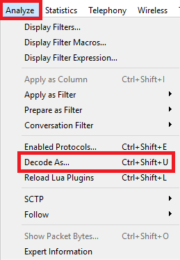
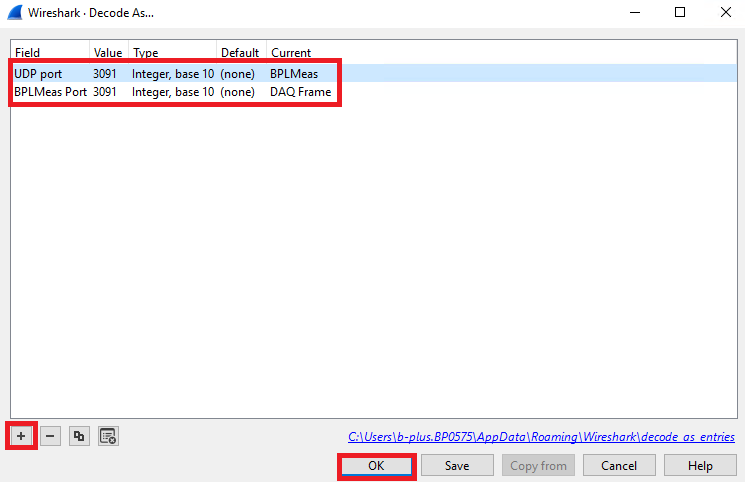
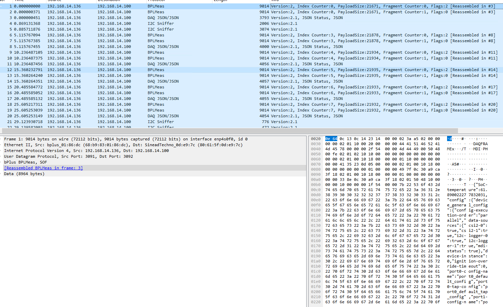
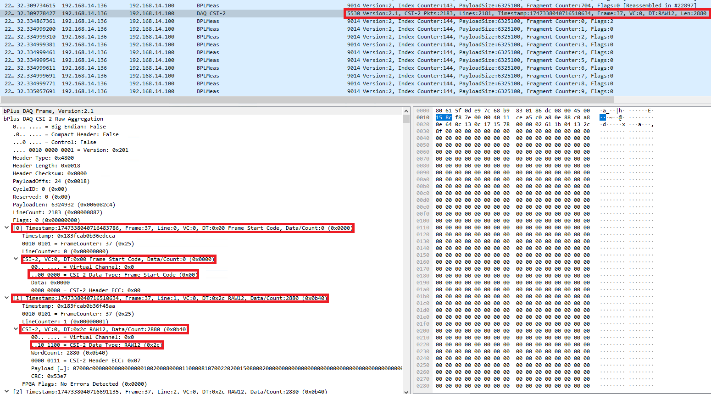
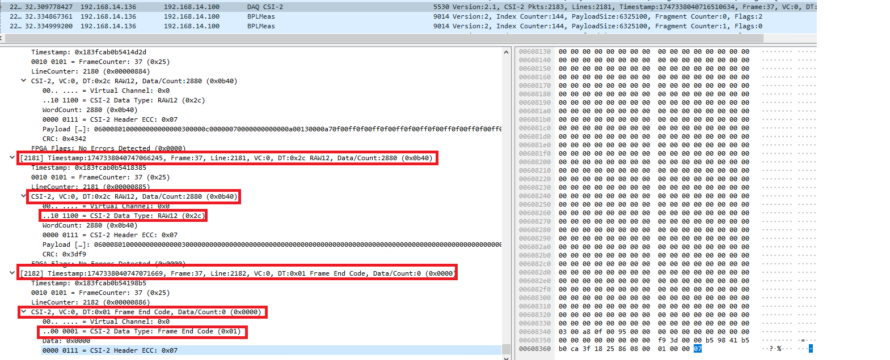
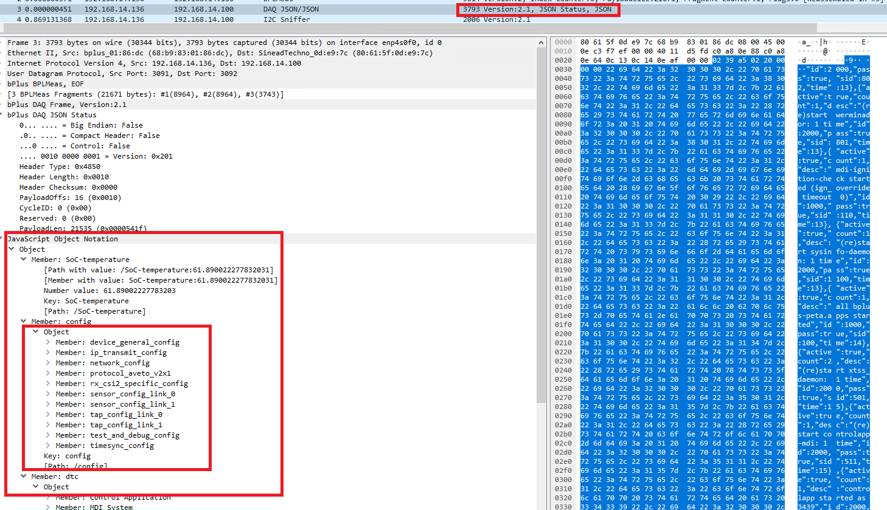
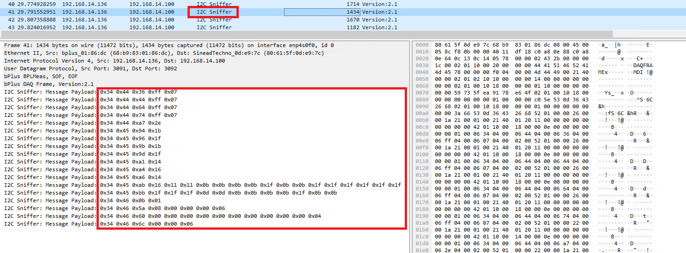
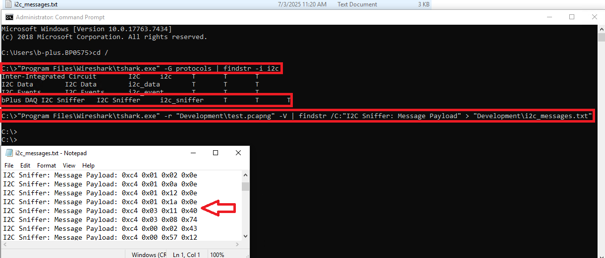

# Using the b-plus MDILink Wireshark Dissector

This guide provides instructions on how to install and use the b-plus MDILink Wireshark Dissector developed for the BPLMeas/DAQ protocol.

---

## Prerequisites

Before using the dissector, ensure you have:

- Wireshark version 4.6
- The custom dissector binary (`.dll`)

---

## Installation

### 1. Install Wireshark
Install Wireshark from the official wireshark download portal: https://www.wireshark.org/download.html 

the latest stable Version is at the moment 4.6

### 2. Place the bplus plugin
Place the bplus.dll in the plugins directory, for example: `C:\Program Files\Wireshark\plugins\4.6\epan` 

### 3. Protocol add in Decoding
After opening Wireshark successfully, you need to press on Analyze→ Decode as...

Add the following parameters:

Afterwards you will be able to see such

### 5. Features

#### 1. DAQ CSI-2 
Here you will be able to see:

and at the end

#### 2. DAQ JSON
Wireshark decode that alone, these are the json information given by the MDILink, like sensor config...

#### 3. DAQ I2C Sniffer
Here you will see all the I2C Communication

## TShark
It is possible to use the I2C Sniffer in TShark to extract all the I2C messages and export it in a .txt file or so, this is very helpful for debugging and building MDILink Configurations

- First open cmd
- run the following command: 

`"Program Files\Wireshark\tshark.exe" -G protocols | findstr -i i2c ` 

to make sure that the protocol is correctly recognized by TShark
- Afterwards run the following command: 

`"Program Files\Wireshark\tshark.exe" -r "Development\test.pcapng" -V | findstr /C:"I2C Sniffer: Message Payload" > "Development\i2c_messages.txt"`

this command will extract the i2c messages from the pcapng and export them to a .txt file

So the whole Procedure will look like this:

Make sure that you saved the decoding as parameters in wireshark before!!!